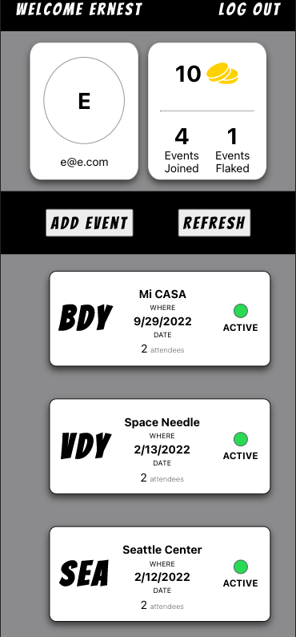
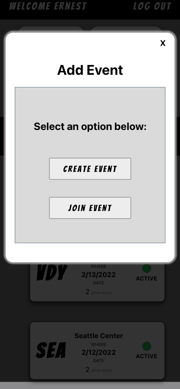
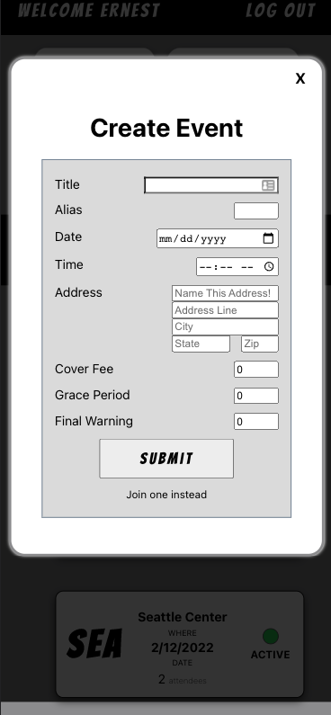
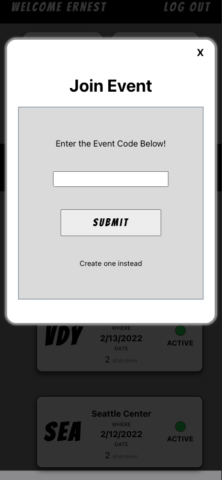
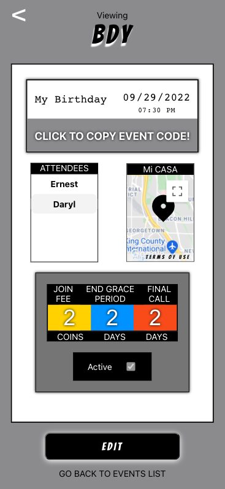
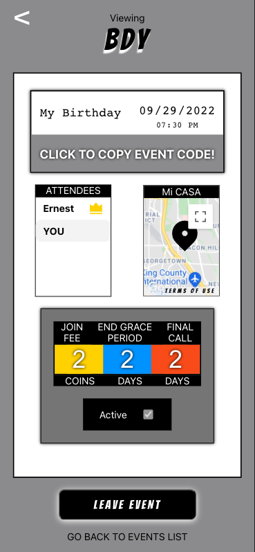

# AIGHT BET
## Don't just plan it, DO IT.

It is a social event scheduling app that encourages people to commit to plans they made with their friends.

[Click here to access the site!](https://aight-bet.herokuapp.com/)

## Screenshots
---
|Splash / Login                    |  About                   | 
|:------------------------:|:-------------:             |
  |   |

| Events Page |  Add Event  | 
|:--------:|:-----------:|
| |   |

| Create Event |  Join Event  | 
|:--------:|:-----------:|
| |   |

|  Event Detail (Host Side)  |  Event Detail (Guest Side)   |
|:------------------------:|:-------------:|
  |  

## Technologies Used
---
Front-end: React, HTML, CSS, JavaScript

Back-end: Node.JS, Express, MongoDB

APIs: Google Maps API, Geocoding API.

## APP PREMISE
-----------

- Each user starts with 10 coins. 
- Like a normal event app, a user can sign in, create an event, input its event details, how much it costs, etc. 
- For a user to join an event, they must – of course – pay up an X amount of coins, set up by the event host. 
- If they follow through with the plan, they get X amount of coins back. 
- If they back out within the grace period set by the host, they get all their coins back. 
- If they back out after the grace period ends, they get half of it back. 
- And finally, if they back out at the last minute, they don’t get anything back. 
- They will receive one mark towards their flake count which will remain in their account forever. 
- Meanwhile, the ones that followed through will get their coins back which they can then use to join another event. 
- So long as the user has coins, they may join any event that has been made through this app and that has been shared to them.
- The app uses the maps API to display the map of the event. It is also deployed on heroku and is best viewed using your mobile browser. 

### What's Next?
- Improve the design of event creation form.
- Improve UI. Smoother transitions.
- Implement in-app chat feature.
- Allow users to add Coins into their accounts.

### Known Bugs?
- App is better viewed in mobile web browsers.
- For demo purposes, leaving an event will add to User's number of events flaked when this should only apply when user leaves after grace period.

---
All rights reserved. Ernest Bruno 2022.